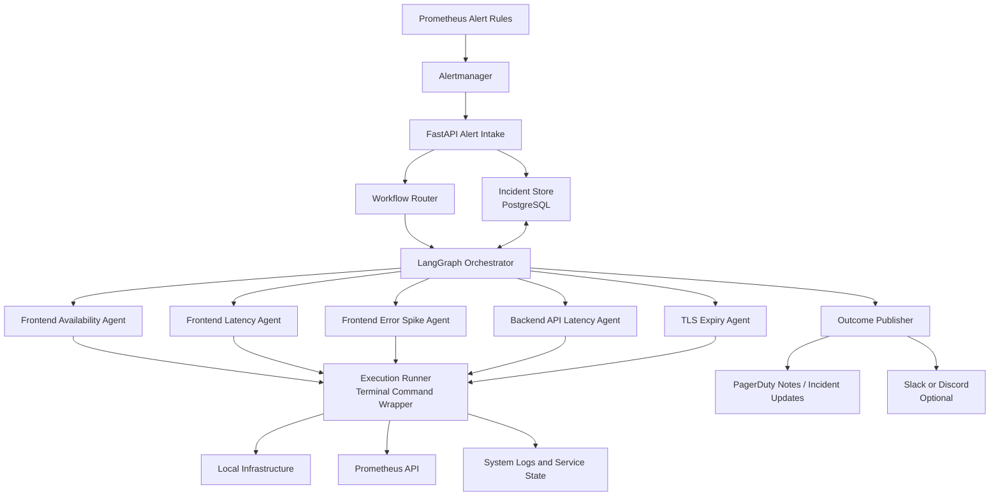
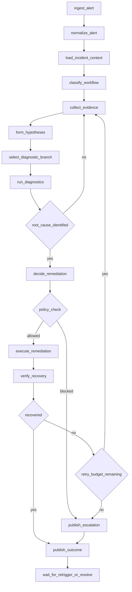

# SRE Agentic Operations Design

Date: 2026-04-19
Status: Draft for review

## Summary

This document proposes a basic alert-driven agentic system that automates operational response workflows for this web application. The system is designed to react only to alerts generated from the current monitoring and paging stack:

- Prometheus
- Alertmanager / Prometheus alerts
- Grafana
- PagerDuty

The system does not attempt to understand the application codebase or database in v1. Its scope is operational workflow execution: receive an alert, determine the corresponding workflow family, collect evidence, identify likely root cause, execute safe local remediation through terminal access, verify recovery, and publish the outcome.

The recommended implementation stack is:

- Python
- LangGraph for workflow orchestration
- LiteLLM for model access
- FastAPI as the alert intake and control-plane API
- PostgreSQL as the incident and workflow state store

## Goals

- React to Alertmanager alerts as the only trigger source in v1.
- Map each alert class to a specialized operational workflow.
- Use explicit, stateful LangGraph workflows rather than a single free-form agent loop.
- Allow the system to perform root cause analysis using terminal access and local observability signals.
- Allow autonomous execution of safe remediations on local infrastructure.
- Preserve auditability through persistent incident state, evidence logs, action logs, and verification results.

## Non-Goals

- Proactive health checks or scheduled maintenance workflows.
- General-purpose chatops as the primary incident intake path.
- Deep application-aware reasoning about business logic, database internals, or feature correctness.
- Broad high-impact autonomous changes such as destructive rollback, host reboot, or state deletion without additional policy controls.

## Current Operational Context

The current SLO and alerting structure documented in `sre-weekly-reports/week_05.md` naturally groups incidents into a small number of operational categories:

- Frontend availability
- Frontend latency
- Frontend error spikes
- Backend API latency under load
- TLS certificate expiry

These categories are the correct unit of specialization for the first version of the system. Each category becomes a dedicated workflow family with its own evidence collection, root-cause hypotheses, and permitted remediations.

## Architecture Decision

The recommended event flow is:

`Alertmanager -> FastAPI -> LangGraph -> terminal execution -> verification -> outcome publishing`

This design makes FastAPI the authoritative incident intake boundary. Slack or Discord may be added later as notification or operator-override surfaces, but they should not be used as the primary delivery path for incidents. Chat platforms are suitable for visibility, not for authoritative event ingestion, deduplication, correlation, and replay.

## System Architecture Diagram

## Alert Handling Lifecycle Diagram

## Main Components

### 1. FastAPI Alert Intake

The FastAPI service is the control-plane entrypoint. It receives Alertmanager webhooks, validates them, normalizes them into an internal incident representation, deduplicates repeated notifications, and starts or resumes the corresponding workflow.

Responsibilities:

- Receive Alertmanager webhook payloads
- Validate source identity and payload shape
- Store raw alert events
- Correlate alert events into incidents
- Create or resume LangGraph runs
- Expose workflow state for operators or future UI integrations

### 2. Incident Store

PostgreSQL is the recommended source of truth for durable workflow execution and auditability.

Minimum persisted entities:

- `incident`
- `alert_event`
- `workflow_run`
- `evidence_item`
- `action_attempt`
- `verification_result`
- `operator_override`

Key incident fields:

- `incident_id`
- `fingerprint`
- `alertname`
- `severity`
- `labels`
- `annotations`
- `status`
- `workflow_type`
- `workflow_state`
- `root_cause_hypothesis`
- `remediation_status`
- `verification_status`

The `incident_id` should also be the stable LangGraph `thread_id`, so each incident has a resumable execution thread.

### 3. Workflow Router

The router should use deterministic alert labels, not prompt interpretation, to map each alert to a workflow family. The alert rules should be enriched with routing labels such as:

- `workflow_type`
- `service_scope`
- `criticality`
- `runbook_id`

Initial mapping:

- `Availability (FE critical endpoints)` -> `frontend_availability`
- `HTTP Latency (standard load)` -> `frontend_latency`
- `HTTP Errors Count` -> `frontend_error_spike`
- `Backend API Latency (high load)` -> `backend_api_latency`
- `TLS Certificate Expiry` -> `tls_expiry`

### 4. LangGraph Orchestrator

LangGraph should model the incident lifecycle as an explicit state machine. The graph is responsible for workflow progression, branching, retries, checkpointing, and outcome publication.

Recommended top-level nodes:

1. `ingest_alert`
2. `normalize_alert`
3. `load_incident_context`
4. `classify_workflow`
5. `collect_evidence`
6. `form_hypotheses`
7. `select_diagnostic_branch`
8. `run_diagnostics`
9. `decide_remediation`
10. `policy_check`
11. `execute_remediation`
12. `verify_recovery`
13. `publish_outcome`
14. `wait_for_retrigger_or_resolve`

The LLM should assist only inside bounded nodes such as:

- hypothesis formation
- branch selection
- remediation selection
- summarization of findings

The overall incident lifecycle, routing, and state transitions should remain deterministic.

### 5. Specialized Workflow Agents

Each operational category should be implemented as a dedicated workflow family or subgraph rather than as a generic autonomous agent.

#### Frontend Availability Agent

Primary concerns:

- process crash
- reverse proxy failure
- static artifact serving failure
- local network issue
- host resource exhaustion

Typical actions:

- inspect service status
- inspect logs
- check endpoint reachability
- restart or reload affected local service

#### Frontend Latency Agent

Primary concerns:

- host saturation
- proxy queuing
- high IO wait
- degraded static serving path

Typical actions:

- inspect latency metrics
- inspect CPU, memory, disk, and sockets
- restart or reload affected service

#### Frontend Error Spike Agent

Primary concerns:

- path-specific 5xx increases
- broad frontend serving failures
- config drift or dependency breakage

Typical actions:

- inspect per-path errors
- inspect service logs around the alert window
- restart targeted local component

#### Backend API Latency Agent

Primary concerns:

- API saturation
- blocked process or worker pool
- host resource pressure
- local dependency slowdown

Typical actions:

- inspect API latency distributions
- inspect request pressure and service health
- restart or reload the API service

#### TLS Expiry Agent

Primary concerns:

- missing or broken renewal
- incorrect certificate deployment
- proxy not reloading new certificate

Typical actions:

- inspect local certificate files and live endpoint certificate
- inspect renewal service or timer status
- run renewal
- reload proxy

### 6. Execution Runner

The execution runner is a policy-enforced terminal wrapper. The workflow may use terminal access, but commands should flow through a structured execution layer rather than an unconstrained shell loop.

Action classes:

- `read_only`
- `safe_mutation`
- `high_impact_mutation`

Examples:

- `read_only`: logs, service status, Prometheus queries, file inspection, endpoint probes
- `safe_mutation`: service restart, service reload, certificate renewal, clearing known temporary failure conditions
- `high_impact_mutation`: rollback, scaling changes, deleting state, rebooting hosts

In v1, only `read_only` and a narrow workflow-specific whitelist of `safe_mutation` actions should be autonomous.

Every command execution should record:

- command
- purpose
- workflow node
- exit code
- start and end timestamps
- stdout summary
- stderr summary

### 7. Outcome Publisher

The system should publish structured outcomes after each handling attempt.

Outputs:

- incident summary
- evidence summary
- likely root cause
- actions executed
- verification result
- escalation state

Primary destinations:

- persistent incident record
- PagerDuty notes or incident updates
- optional Slack or Discord notifications in later phases

## Safety Model

The system is autonomous only within a bounded response policy.

Every remediation should require:

- a matching workflow family
- sufficient supporting evidence
- an allowed command from the workflow whitelist
- a retry budget and cooldown check
- a verification plan after execution

The workflow must stop and escalate if:

- evidence is contradictory
- confidence is too low
- previous safe remediations failed
- the only remaining options are high-impact actions
- the observed blast radius appears larger than the workflow scope

## Simple End-to-End Illustration

The example below shows how the system would handle a frontend availability incident.

### Scenario

Alert fired:

- Alert class: `Availability (FE critical endpoints)`
- Severity: `critical`
- Source: Alertmanager

### End-to-End Flow

1. Alertmanager sends a webhook to FastAPI.
2. FastAPI validates the payload, stores the raw event, and correlates it to an incident.
3. The router maps the alert to `frontend_availability`.
4. LangGraph starts or resumes the corresponding workflow thread.
5. The workflow collects evidence:
   - current error ratios from Prometheus
   - local endpoint probe results
   - frontend service status
   - reverse proxy status
   - recent logs from the relevant services
   - host resource signals
6. The workflow forms likely hypotheses, for example:
   - frontend process is down
   - reverse proxy is misconfigured or unhealthy
   - host resource exhaustion is causing 5xx responses
7. Diagnostics determine that the frontend service is unhealthy and repeatedly failing startup due to a local transient issue already covered by an approved remediation.
8. Policy check allows a safe remediation: restart the frontend service.
9. The execution runner performs the restart and records the action.
10. The workflow verifies recovery:
    - service becomes healthy
    - endpoint probe succeeds
    - error ratio drops
11. The workflow publishes the outcome:
    - likely root cause
    - action executed
    - verification passed
12. The incident remains observable until Alertmanager sends the resolved event or the workflow confirms stable recovery.

## Why This Design Fits The Current Stack

- It keeps Prometheus and Alertmanager as the operational source of truth.
- It preserves PagerDuty as the human paging layer.
- It does not depend on application-aware code reasoning in the first version.
- It matches the existing SLO and alert taxonomy from `week_05.md`.
- It allows incremental rollout from diagnostics-only to bounded autonomous remediation.

## Implementation Guidance

Recommended rollout order:

1. Build the FastAPI intake service and incident persistence model.
2. Implement alert routing and a generic top-level LangGraph skeleton.
3. Add read-only evidence collection for all five workflow families.
4. Enable a small set of autonomous remediations for the safest workflows first, starting with TLS renewal and narrowly scoped service restart actions.
5. Add outcome publishing and incident replay tooling for testing and post-incident analysis.

## Open Design Choices For Implementation Phase

- Exact schema for Alertmanager label enrichment
- Final list of permitted commands per workflow family
- Whether command execution runs on the same host or through a separate local runner service
- Whether Slack or Discord should be added as a secondary visibility surface
- Exact verification thresholds after remediation

## Acceptance Criteria For The Design

The design is successful if the implemented system can:

- receive an Alertmanager incident
- route it to the correct workflow family
- collect evidence through Prometheus and terminal-based local inspection
- choose a bounded remediation when permitted
- verify recovery
- persist and publish a complete audit trail of what happened
